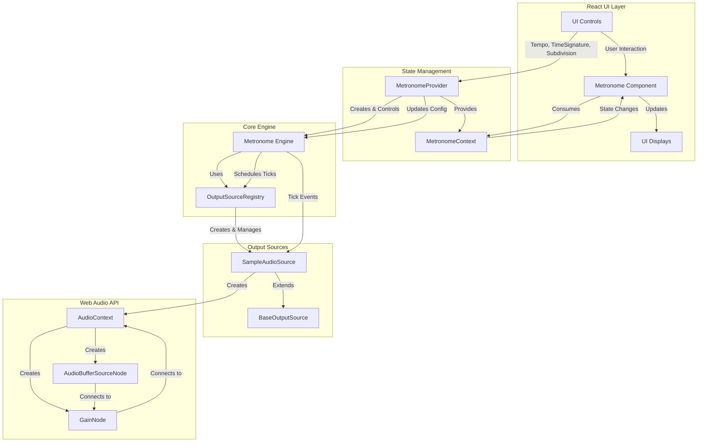

# Metronome Architecture

This diagram illustrates the architecture of the Metrodome application after removing the Tone.js dependency and implementing a custom Web Audio API-based solution.

## Key Components

### React UI Layer
- **Metronome Component**: The main UI component that integrates all controls and displays
- **Controls**: UI components for tempo, time signature, subdivision, and playback
- **Displays**: Visual feedback components like beat visualizer and tempo display

### State Management
- **MetronomeProvider**: React context provider that manages the metronome state
- **MetronomeContext**: Context that exposes metronome state and methods to components

### Core Engine
- **Metronome Engine**: Handles timing, scheduling, and tick events (30-300 BPM with jitter ≤0.5ms)
- **OutputSourceRegistry**: Registry that manages different output sources

### Output Sources
- **BaseOutputSource**: Abstract base class for all output sources
- **SampleAudioSource**: Concrete implementation using Web Audio API for sample playback

### Web Audio API
- **AudioContext**: Main entry point to the Web Audio API
- **GainNode**: Controls volume
- **AudioBufferSourceNode**: Plays the click sounds

## Data Flow

1. User interacts with UI Controls (tempo, time signature, etc.)
2. MetronomeProvider updates state and calls methods on Metronome Engine
3. Metronome Engine schedules ticks and sends events to OutputSourceRegistry
4. OutputSourceRegistry forwards events to enabled output sources
5. SampleAudioSource plays pre-recorded samples using Web Audio API
6. UI is updated to reflect current state

## Key Features

- **Precise Timing**: Uses Web Audio API for accurate scheduling with jitter ≤0.5ms
- **Flexible Output**: Architecture supports multiple output types (audio, visual, etc.)
- **Standardized Subdivisions**: Quarter and eighth note subdivisions
- **Full Tempo Range**: Supports 30-500 BPM
- **Real-time Updates**: All parameters can be changed during playback
